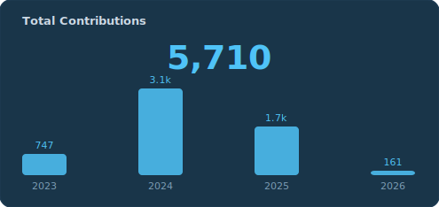
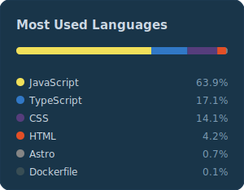

<h1 align="center">Hi, I'm Benjamin! 👋</h1>

  

---

<h2 align="center">🧑‍💻 About Me</h2>

  Fullstack Developer con foco en arquitectura limpia y código mantenible. 
  React · Next.js · Tailwind · TypeScript · Node.js 

  📍 Tucumán, Argentina &nbsp;·&nbsp;
  🌐 <a target="_blank" href="https://portfolio.22studios.xyz"><b>portfolio.22studios.xyz</b></a>

---

<h2 align="center">⚡ Skills & Technologies</h2>

  <!-- Core -->
  
  
  
  <!-- Frontend -->
  
  
  
  
  
  
  <!-- State -->
  
  
  <!-- Backend -->
  
  
  <!-- Databases -->
  
  
  
  <!-- Tooling -->
  
  
  
  <!-- DevOps -->
  
  

---

<h2 align="center">📊 GitHub Stats</h2>

<!-- ═══════════════════════════════════════════════════════
     PRIMARY: SVGs propios, auto-actualizados cada 24h
     vía GitHub Actions (see .github/workflows/stats.yml)
     ═══════════════════════════════════════════════════════ -->

  
  &nbsp;
  

  

<!--
  ═══════════════════════════════════════════════════════
  FALLBACK: Stats externas — descomentar si los SVGs
  propios fallan o el workflow no ha corrido todavía.
  ═══════════════════════════════════════════════════════

  

    
    
  

-->

---

<h2 align="center">📫 Contact</h2>

  
  &nbsp;
  
  &nbsp;
  

  

